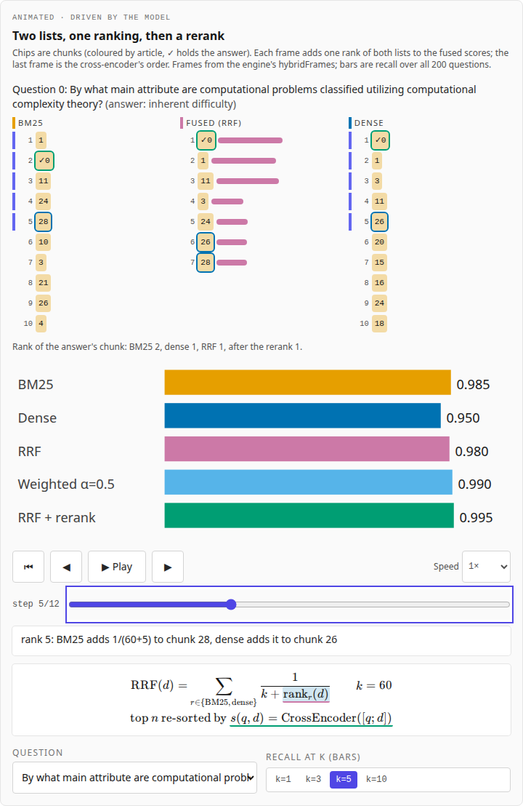
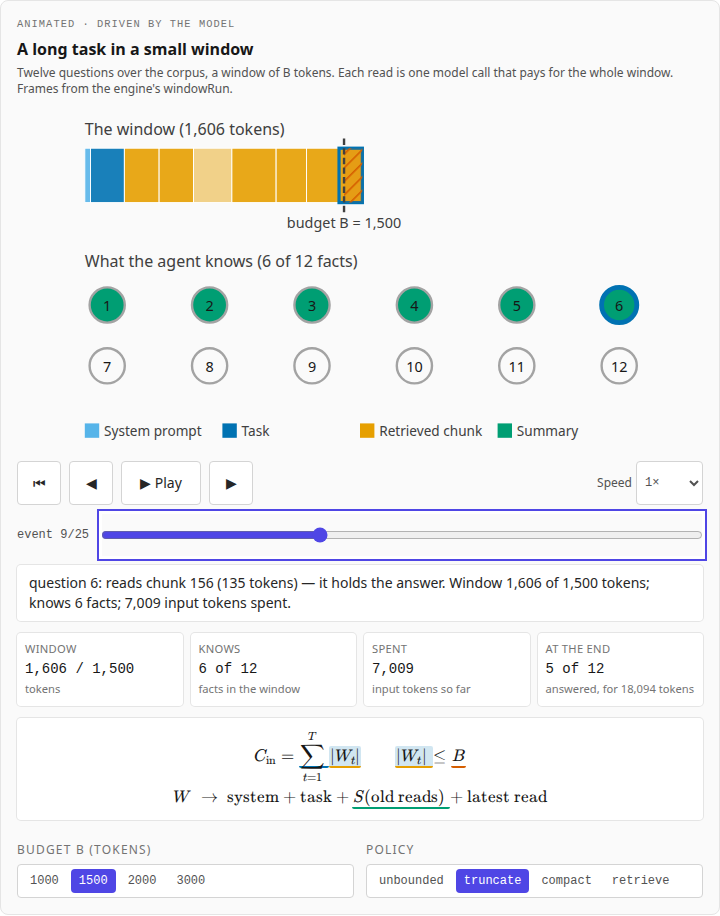
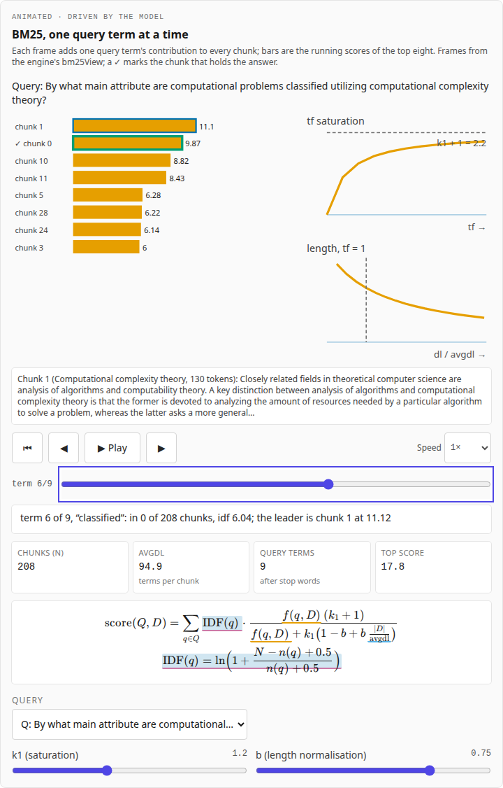
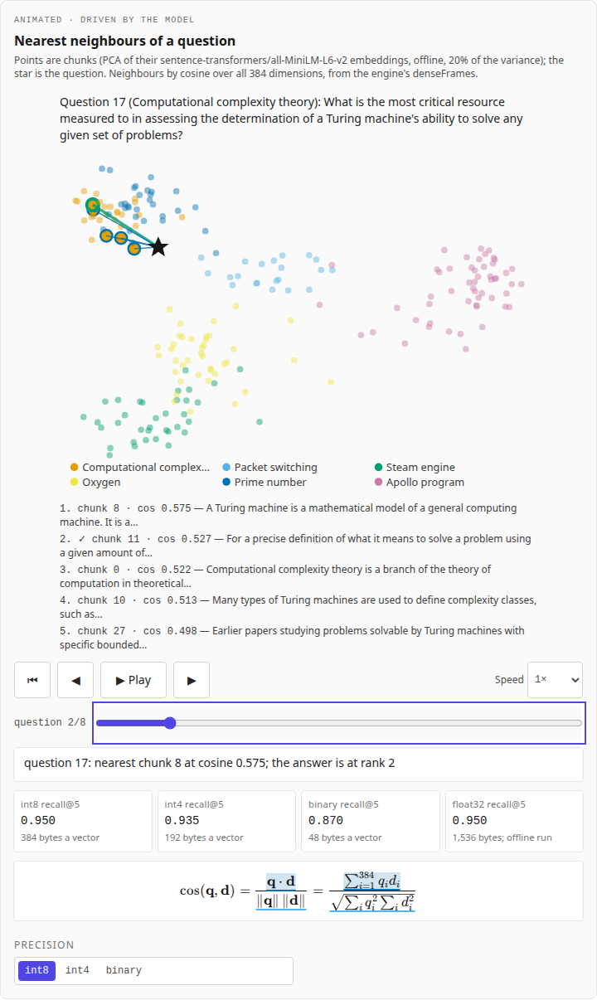
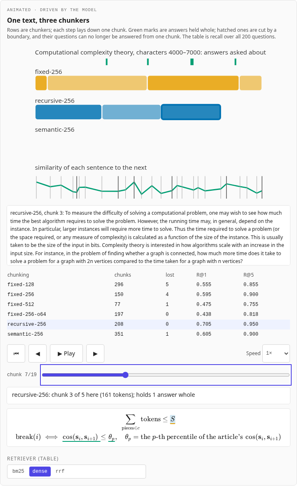

# Agent Context Explained

**Live:** https://agent-context-explained.vercel.app

Context engineering, measured: what goes into an agent's context window, and how an agent remembers beyond it.
These chapters cover the window as working memory and the retrieval that fills it (BM25, dense retrieval, hybrid
fusion and reranking, chunking). Each is built around an animation, with the maths beside the picture, and every
number is **measured on a fixed, openly licensed corpus**: 6 articles of the
[SQuAD v1.1](https://rajpurkar.github.io/SQuAD-explorer/) development set (CC BY-SA 4.0) and 200 of their
questions, each with its answer's exact position, so a retriever either finds the chunk that holds the answer or
does not. An embedding model ([all-MiniLM-L6-v2](https://huggingface.co/sentence-transformers/all-MiniLM-L6-v2))
and a cross-encoder ([ms-marco-MiniLM-L6-v2](https://huggingface.co/cross-encoder/ms-marco-MiniLM-L6-v2)) ran
**once, offline**; their outputs (int8 vectors, recorded scores) ship with the site, and
[Agent_Loop_Sim](https://github.com/BrendanJamesLynskey/Agent_Loop_Sim)'s context module recomputes every chunk
boundary, score, ranking and metric from them, identically in Python and in the browser. No language model or
embedding model runs on the site or in CI.



Part of a family of companion sites. Agents: [Agent Harnesses Explained](https://agent-harnesses-explained.vercel.app),
[Agent Protocols Explained](https://agent-protocols-explained.vercel.app) and this one. LLM systems: the
[Transformer Decoder Explainer](https://transformer-decoder-explained.vercel.app),
[LLM Inference Explained](https://llm-inference-explained.vercel.app),
[LLM Architectures Explained](https://llm-architectures-explained.vercel.app),
[GPU Kernels Explained](https://gpu-kernels-explained.vercel.app),
[Numerics Explained](https://numerics-explained.vercel.app),
[Systolic Arrays Explained](https://systolic-arrays-explained.vercel.app) and
[Inference Trade-offs Explained](https://inference-tradeoffs-explained.vercel.app).

## Chapters

| #   | Chapter                                                                                                                  | The animation                                                                                                                                           |
| --- | ------------------------------------------------------------------------------------------------------------------------ | ------------------------------------------------------------------------------------------------------------------------------------------------------- |
| 1   | [The window is the working memory](https://agent-context-explained.vercel.app/learn/01-the-window-is-the-working-memory) | A twelve-question task in a small window: what the agent knows grows with each read and shrinks as the window is truncated, compacted or searched again |
| 2   | [Lexical retrieval: BM25](https://agent-context-explained.vercel.app/learn/02-lexical-retrieval)                         | BM25 scored term by term for a question or a typed query; tf saturation (k1) and length normalisation (b) as curves                                     |
| 3   | [Dense retrieval](https://agent-context-explained.vercel.app/learn/03-dense-retrieval)                                   | Chunks on a 2-D projection of their embeddings; the query moves and its nearest neighbours light up; int8, int4 and binary recall                       |
| 4   | [Hybrid retrieval and reranking](https://agent-context-explained.vercel.app/learn/04-hybrid-and-reranking)               | Two ranked lists merging under RRF rank by rank, then a cross-encoder reordering the top 20; recall@k per stage                                         |
| 5   | [Chunking](https://agent-context-explained.vercel.app/learn/05-chunking)                                                 | One text cut three ways (fixed, recursive, semantic), the answers each cut in two, and each chunking's recall                                           |

Chapters 6 to 9 (packing the window, compaction, agent memory, long context against retrieval) follow.

| The window                                | BM25                                  | Dense                                   | Chunking                                      |
| ----------------------------------------- | ------------------------------------- | --------------------------------------- | --------------------------------------------- |
|  |  |  |  |

## Results

From the engine's recorded run ([`context_results.md`](src/data/context_results.md), vendored), recursive
256-token chunks, all 200 questions:

| Stage                                     | recall@1 | recall@5 | MRR@10 | nDCG@10 |
| ----------------------------------------- | -------- | -------- | ------ | ------- |
| BM25 (k1 1.2, b 0.75)                     | 0.785    | 0.985    | 0.869  | 0.899   |
| Dense, int8                               | 0.705    | 0.950    | 0.806  | 0.849   |
| Dense, binary                             | 0.600    | 0.870    | 0.720  | 0.778   |
| RRF (k 60)                                | 0.810    | 0.980    | 0.883  | 0.912   |
| RRF, then the cross-encoder on the top 20 | 0.890    | 0.995    | 0.937  | 0.952   |

BM25 beats the small embedder on this corpus (SQuAD's questions reuse the paragraph's words); int8 vectors lose
nothing against float32 here, one-bit vectors lose 8 points of recall@5; fixed 128- and 256-token chunks cut 5
and 4 answers in two; 512-token chunks overrun the embedder's 256 word pieces. The [data page](https://agent-context-explained.vercel.app/data)
has every result, the model revisions and every file's SHA-256.

## The engine

The site vendors Agent_Loop_Sim's TypeScript port and its context data at a pinned commit
(`pnpm vendor:engine <sha>`; `src/lib/engine/vendor/VENDORED.json` records the commit and each file's SHA-256)
and runs it in a Web Worker, which fetches the tokenizer and only the data files a chapter needs
(`public/context/`, 1.7 MB in all). Its `context` module (engine 1.4.0) has the corpus and questions, three
chunkers (fixed with optional overlap, recursive, semantic) cutting between Qwen2.5 pre-tokenizer pieces,
BM25, dense retrieval at int8, int4 and binary precision, RRF and weighted fusion, a reranker stage over the
recorded cross-encoder scores, recall@k, MRR@10 and nDCG@10, and the window task of chapter 1. Python and TS
agree exactly: integer vector arithmetic, and a shared transcription of fdlibm's logarithm for BM25's IDF and
nDCG. This site's CI installs the reference at the vendored commit, regenerates `tests/fixtures/site_fixtures.json`
and requires the port to reproduce it.

## What is illustrative

Chapter 1's window task: a scripted agent (BM25 search, at most three reads a question), budgets scaled down to
1,000–3,000 tokens, and a summariser that keeps every fact by construction. The sentence splitter is a simple
rule; the semantic chunker's threshold (25th percentile) and the chunk sizes are choices. The 2-D map of
chapter 3 is a projection for the eye. The float32 baselines come from the offline run alone. Everything else
(the corpus, the questions, the embeddings, the reranker's scores and every metric) is real.

## Checks

| Check                                                                                                                                                                                        | Where                                                                        |
| -------------------------------------------------------------------------------------------------------------------------------------------------------------------------------------------- | ---------------------------------------------------------------------------- |
| Python reference regenerates the site's fixtures; vendored hashes; data files match the engine's manifest                                                                                    | CI "Model and fixtures" (`scripts/make_fixtures.py --check`, `tests/python`) |
| TS engine = Python reference on everything each chapter animates, exactly; captions; chapters' code, equations, links and values                                                             | CI "Unit Tests" (`tests/unit`)                                               |
| Every page at 1,280 and 390 px, light and dark: no errors, no overflow; every animation plays, steps, scrubs, resets, keys; reduced motion; frame captions on the page; axe; the site switch | CI "E2E Tests" (`tests/e2e`)                                                 |
| Lighthouse ≥ 0.9 (performance, accessibility, best practices)                                                                                                                                | CI "Lighthouse"                                                              |

## Develop

```bash
pnpm install
pnpm dev                                    # http://localhost:3000
pnpm test && pnpm lint && pnpm typecheck
python3 -m venv .venv && .venv/bin/pip install -r reference/requirements.txt
.venv/bin/python scripts/make_fixtures.py --check
pnpm test:e2e                               # builds, then serves under --no-experimental-require-module
```

Deploying, smoke checks and updating the engine: [RUNBOOK.md](RUNBOOK.md).

## Origin

The structure, animation infrastructure (`useStepper`, `AnimationPanel`, the clock), MDX pipeline, CI,
checks and the two-group site switch are copied from
[agent-protocols-explained](https://github.com/BrendanJamesLynskey/agent-protocols-explained) (itself from
agent-harnesses-explained and gpu-kernels-explained); the engine vendoring follows llm-inference-explained.

## Licence

MIT. Third-party files and their licences: [NOTICE](NOTICE).
